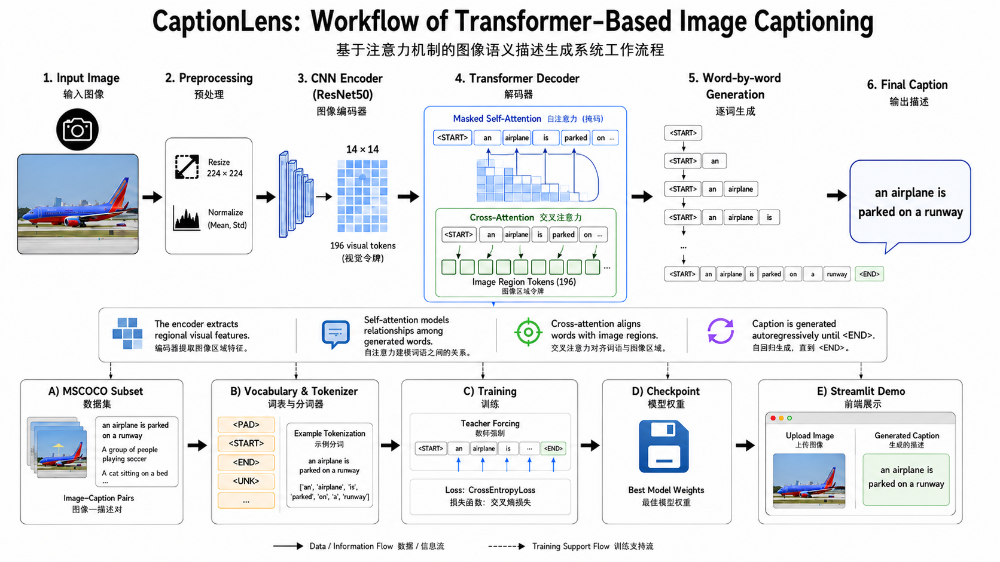
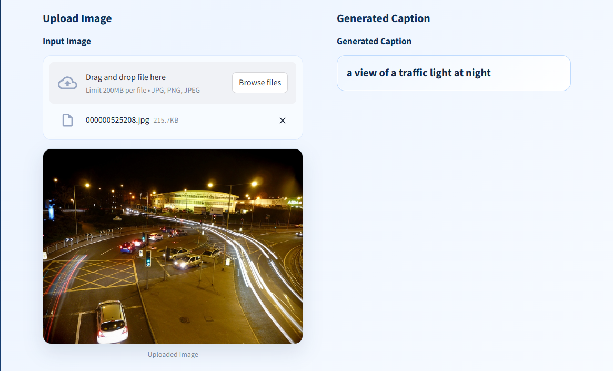
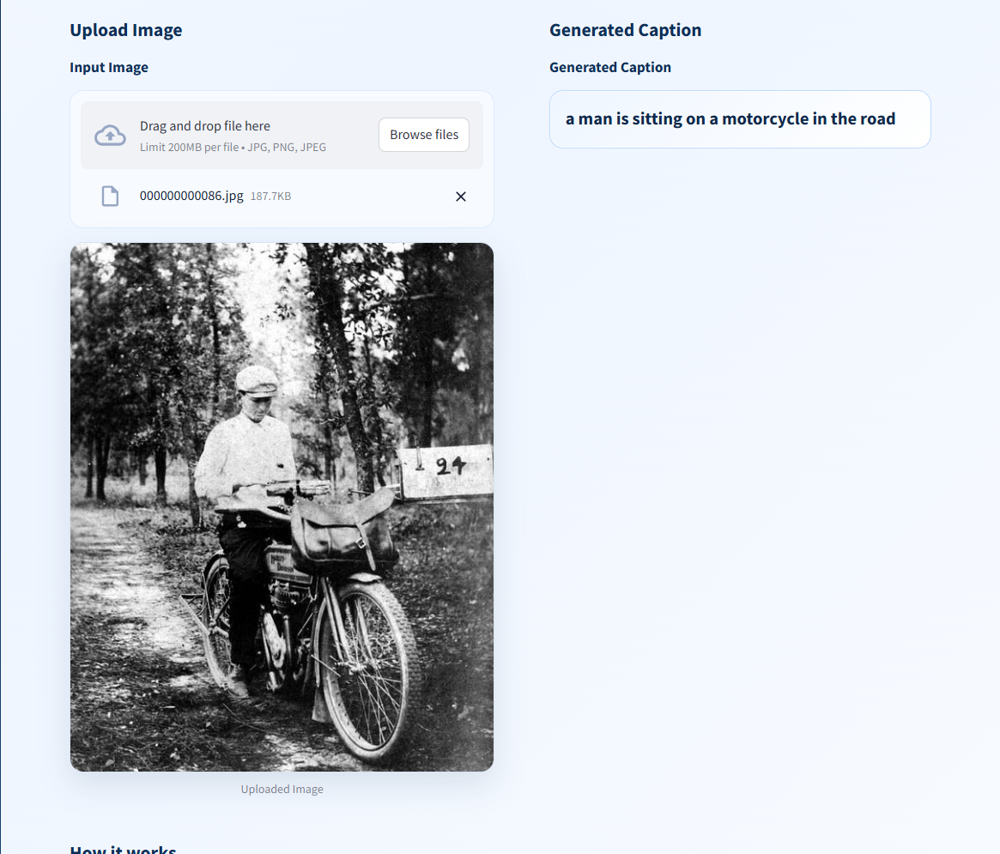

<div align="center">
  <h1>CaptionLens</h1>
  <p><strong>Image Semantic Captioning with Self-Attention and Cross-Attention</strong></p>
  <p>融合自注意力与交叉注意力机制的图像语义描述生成系统</p>
</div>

## 项目简介

CaptionLens 是一个基于深度学习的图像语义描述生成系统。项目以 ResNet50 作为 CNN 图像编码器，从输入图片中提取区域视觉特征；再使用 Transformer Decoder 作为文本解码器，通过 masked self-attention 建模已生成词语之间的上下文关系，并通过 cross-attention 对齐文本 token 与图像区域特征，最终逐词生成自然语言 caption。

项目覆盖了图像描述任务的完整实验流程，包括 MSCOCO 子集下载、词表构建、模型训练、模型推理和 Streamlit 前端展示。当前前端已经优化为更适合课程项目、科研项目展示和保研面试讲解的 AI Demo 页面。

项目仓库：[cpn-cyber/CaptionLens](https://github.com/cpn-cyber/CaptionLens)

## 项目工作流

下图展示了 CaptionLens 从图像输入、预处理、ResNet50 视觉编码、Transformer 解码、逐词生成到最终 caption 输出的完整流程，也补充展示了 MSCOCO 子集、词表构建、训练、权重保存和 Streamlit 前端演示之间的关系。



## 功能亮点

- **ResNet50 Encoder**：使用预训练 ResNet50 提取图像高层语义特征。
- **14 x 14 Visual Tokens**：将图像转换为 196 个区域视觉 token，便于 Transformer 进行图文对齐。
- **Transformer Decoder**：使用自注意力和交叉注意力完成文本生成。
- **MSCOCO Subset Training**：支持下载 COCO 子集并在本地完成训练。
- **Streamlit Demo**：支持上传 jpg、png、jpeg 图片，并实时展示生成描述。
- **现代化前端展示**：页面包含项目标题、技术标签、上传区域、结果卡片、模型流程说明和项目信息侧边栏。

## Demo 展示

以下截图均为本地重新启动 Streamlit 后，上传测试图片得到的真实推理结果。

### 示例一：夜间交通场景

模型输出：

```text
a view of a traffic light at night
```



### 示例二：黑白老照片

模型输出：

```text
a man is sitting on a motorcycle in the road
```

这张样例是一张黑白老照片，可以体现模型不仅能处理普通彩色图像，也能对低色彩信息、历史照片风格的图像进行基础语义分析。



## 系统流程

```text
Input Image
  -> Resize / Normalize
  -> ResNet50 CNN Encoder
  -> 14 x 14 regional visual tokens
  -> Transformer Decoder
     -> Masked Self-Attention
     -> Cross-Attention over image features
  -> Word-by-word Caption Generation
  -> Final Caption
```

页面下方的 “How it works” 区域也对应展示了系统的四个关键步骤：

| 模块 | 作用 |
| --- | --- |
| CNN Encoder | 从输入图像中提取区域视觉特征 |
| Visual Tokens | 将图像表示为 14 x 14 个视觉区域 token |
| Self-Attention | 建模生成词之间的上下文依赖 |
| Cross-Attention | 将文本 token 与图像区域特征对齐 |

## 模型原理

### 1. 图像编码器

`models/encoder.py` 中的 `CNNEncoder` 使用 `torchvision.models.resnet50(pretrained=True)` 加载预训练 ResNet50，并移除最后的分类层。编码器保留卷积特征图，通过 `AdaptiveAvgPool2d((14, 14))` 固定空间尺寸，再使用 `1x1 Conv` 将通道维度压缩到 Transformer 使用的 `embed_size`。

输出形状可以理解为：

```text
(B, 3, H, W)
  -> ResNet50 convolutional features
  -> (B, 2048, 14, 14)
  -> 1x1 Conv
  -> (B, embed_size, 14, 14)
  -> flatten
  -> (B, 196, embed_size)
```

其中 196 个向量就是图像的区域视觉 token。

### 2. Transformer 文本解码器

`models/decoder.py` 中的 `TransformerDecoder` 包含词嵌入、位置编码和多层 Transformer Decoder Layer。解码器在每一步生成时都会使用 causal mask，保证当前位置只能看到已经生成的词，不能提前看到未来词。

每一层 Decoder 主要包含：

- **Masked Self-Attention**：学习 caption 内部词与词之间的关系。
- **Cross-Attention**：根据当前文本状态关注图像区域 token。
- **Feed Forward Network**：进一步进行非线性特征变换。

### 3. 训练目标

训练阶段使用 teacher forcing：给定真实 caption 的前缀，模型预测下一个词。损失函数为 `CrossEntropyLoss`，并忽略 `<PAD>` token 对 loss 的影响。

```text
<START> a man riding a horse
          -> predict next token step by step
```

### 4. 推理方式

当前前端推理函数从 `<START>` 开始自回归生成 caption，并在每一步调用 Transformer Decoder 预测下一个 token。为了减少重复短语和 `<UNK>`，前端推理中加入了 beam search、重复 token 惩罚、no-repeat bigram 约束和 `<UNK>` 惩罚，使输出比最基础的 greedy decoding 更稳定。

## 项目结构

```text
CaptionLens/
├── app.py                         # Streamlit 前端页面与图像上传推理入口
├── train.py                       # 模型训练脚本
├── infer.py                       # 推理函数
├── build_vocab.py                 # 根据 COCO caption 构建词表
├── download_coco_subset.py        # 下载 COCO 标注与 1000 张图像子集
├── requirements.txt               # Python 依赖
├── config/
│   └── config.yaml                # 数据、模型和训练超参数
├── models/
│   ├── encoder.py                 # ResNet50 图像编码器
│   ├── decoder.py                 # Transformer 文本解码器
│   └── image_captioning.py        # Encoder + Decoder 总模型
├── utils/
│   ├── dataset.py                 # COCO 图像-caption 数据集封装
│   └── tokenizer.py               # 文本清洗、词表、编码与解码
└── screenshots/
    ├── workflow.png
    ├── captionlens_traffic_night_demo_cropped.png
    └── captionlens_bw_motorcycle_demo_cropped.png
```

## 快速开始

### 1. 安装依赖

```powershell
cd C:\Users\13178\Desktop\CaptionLens
pip install -r requirements.txt
```

### 2. 下载 COCO 子集

```powershell
python download_coco_subset.py
```

脚本会下载 COCO 2017 captions 标注，并下载约 1000 张训练图片到：

```text
data/raw/train2017_subset
```

### 3. 构建词表

```powershell
python build_vocab.py
```

输出文件：

```text
data/vocab.pkl
```

### 4. 训练模型

```powershell
python train.py
```

训练后会保存模型权重：

```text
checkpoints/best_model.pth
```

### 5. 启动前端

```powershell
streamlit run app.py
```

如果默认端口被占用，可以指定端口：

```powershell
streamlit run app.py --server.port 8503
```

访问地址：

```text
http://localhost:8501
```

或：

```text
http://localhost:8503
```

## 当前本地训练情况

当前仓库默认不包含预训练权重和词表文件，因此需要先完成数据下载、词表构建和模型训练。本地已经基于 1000 张 COCO 子集图片完成训练，并生成：

```text
data/vocab.pkl
checkpoints/best_model.pth
```

由于训练数据量较小、训练轮数有限，当前模型更适合用于展示图像描述系统的完整工作流程和注意力机制原理。它可以生成较合理的粗粒度语义描述，但不保证与 COCO 原始标注完全一致，也可能在数量、细节或场景关系上出现偏差。

## 技术栈

| 模块 | 技术 |
| --- | --- |
| 深度学习框架 | PyTorch |
| 图像编码器 | ResNet50, TorchVision |
| 文本解码器 | Transformer Decoder |
| 注意力机制 | Self-Attention, Cross-Attention |
| 数据集 | MSCOCO 2017 Captions Subset |
| 图像处理 | Pillow, TorchVision Transforms |
| 配置管理 | YAML |
| Web Demo | Streamlit |

## 前端设计

当前 `app.py` 使用 Streamlit + HTML/CSS 实现了一个简洁专业的 AI 项目展示页面，主要包括：

- 顶部项目 Header：展示 CaptionLens、英文副标题和中文说明。
- 技术标签：Transformer、Self-Attention、Cross-Attention、MSCOCO、Streamlit。
- 上传区域：支持 jpg、png、jpeg 图片上传，并展示圆角原图。
- 结果区域：用浅蓝色卡片突出展示生成 caption。
- 流程说明：用四个小卡片解释 CNN Encoder、Visual Tokens、Self-Attention、Cross-Attention。
- 侧边栏信息：展示模型结构、注意力机制、数据集、解码方式和运行设备。

## 局限与改进方向

- 当前训练集只有 COCO 子集，语义覆盖范围有限。
- 词表基于简单英文分词，低频词会被映射为 `<UNK>`。
- 模型没有加入 BLEU、METEOR、CIDEr 等自动评估指标。
- 没有单独划分验证集，当前训练主要用于跑通流程和展示效果。
- 可以进一步扩大训练集、增加训练轮数，并加入 beam search 参数调优。
- 后续可以加入 attention heatmap，可视化模型在生成某个词时关注的图像区域。

## 总结

CaptionLens 展示了一个典型的 CNN Encoder + Transformer Decoder 图像描述系统：先用 CNN 理解图像，再用 Transformer 注意力机制完成图文对齐和自然语言生成。相比只展示单张图片预测结果的简单 demo，本项目包含数据准备、词表构建、模型训练、推理生成和前端展示，适合作为图像语义理解、视觉语言建模和 Transformer 注意力机制的综合实践项目。

## License

This project is licensed under the MIT License. Copyright (c) 2026 cpn-cyber.
